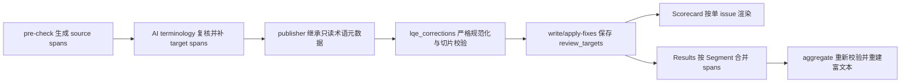

# LQE 术语精确标记开发文档

## 1. 文档信息

| 项目 | 内容 |
|---|---|
| 功能 | 在 LQE Excel 报告中精确标红受术语问题影响的原文词和本轮送审译文词 |
| 仓库 | `tzwkb/lqe-translator` |
| 开发日期 | 2026-08-06 |
| 功能提交 | `9e93b35 Add precise terminology highlighting` |
| 合并 PR | `#7 Add precise terminology highlighting` |
| 合并提交 | `66435b3` |
| 兼容策略 | 术语问题产物直接升级，不兼容缺少结构化跨度的旧产物 |
| 当前状态 | 已合并并通过自动化回归 |

本文档描述术语精确标记的数据合同、处理链路、Excel 富文本规则、迭代与聚合行为，以及旧任务升级策略。通用 LQE 操作流程仍以根目录 `SKILL.md` 为准。

## 2. 背景

原报告已有翻译差异标红：

- 原译中删除或替换的内容显示红色删除线。
- AI/建议译文中新增或替换的内容显示红字。

但 Terminology 问题只有自由文本 `comment`，无法可靠回答以下问题：

1. 原文中究竟是哪一个术语触发问题。
2. 当前译文中哪一段文字是错误术语。
3. 同一句包含多个术语或同词多次出现时，应标记哪一次。
4. 后续迭代改变译文长度后，旧 offset 应对应哪一版译文。

从 `comment` 反解析术语存在语言、标点、引号和重复词歧义，也无法稳定支持漏译。因此本次改造将术语位置提升为正式结构化合同，由生产、校验、报告和聚合全链路直接消费。

## 3. 目标与非目标

### 3.1 目标

- 每个 Terminology issue 明确携带原文术语、预期译法和精确字符跨度。
- `LQA Scorecard` 与 `LQE Results` 都能标红受影响词。
- 术语标记与现有差异标红使用确定的优先级，不互相覆盖。
- 第 2 轮及后续迭代使用该轮实际送审译文作为 offset 基线。
- 多工作表聚合报告保持与子报告一致的标记。
- 旧术语产物失败关闭，并提供从 `pre-check` 重建的恢复路径。
- `*_corrected.*` 保持纯文本，不写入审校样式。

### 3.2 非目标

- 不从问题说明、自然语言评论或旧 edit 猜测跨度。
- 不把整句建议写回 `term_spans`。
- 不改变评分权重、严重度或自动修改授权规则。
- 不修改原始输入文件。
- 不为历史 Excel 报告做原地迁移。
- 不在无术语模式中重新启用 Terminology 检查。

## 4. 核心数据合同

### 4.1 Terminology issue

每个 `category == "Terminology"` 的问题除通用字段外，必须包含：

```json
{
  "category": "Terminology",
  "severity": "Major",
  "comment": "The confirmed project term is not used.",
  "needs_confirmation": true,
  "edit": null,
  "term_source": "督管案台",
  "expected_targets": ["Supervisor's Counter"],
  "term_spans": {
    "source": [
      {"start": 2, "end": 6, "text": "督管案台"}
    ],
    "target": [
      {"start": 10, "end": 22, "text": "control desk"}
    ]
  }
}
```

字段定义：

| 字段 | 类型 | 约束 |
|---|---|---|
| `term_source` | string | 非空；每个 source span 的 `text` 必须与其完全一致 |
| `expected_targets` | string[] | 至少一个非空候选；保留术语表多义候选 |
| `term_spans.source` | span[] | 至少一个；定位受影响原文术语 |
| `term_spans.target` | span[] | 可为空；定位本轮送审译文中的错误词 |

`term_source`、`expected_targets`、`term_spans` 必须同时出现。非 Terminology 类别如果主动携带任一术语字段，也必须完整携带三项并通过相同校验，避免旁路注入无效跨度。

### 4.2 Span

每个 span 必须恰有三个字段：

```json
{"start": 10, "end": 22, "text": "control desk"}
```

约束如下：

1. `start`、`end` 必须是整数；布尔值不视为整数。
2. 使用 Python 字符串索引的 0-based、左闭右开区间 `[start, end)`。
3. 必须满足 `0 <= start < end <= len(text)`。
4. span 的 `text` 必须严格等于对应文本切片。
5. 数组按 `(start, end, text)` 升序排列。
6. 同一数组内不允许重复或重叠。
7. `term_spans` 对象只能包含 `source` 和 `target` 两个键。

`target` 允许为空的典型场景：

- 术语漏译。
- 当前译文没有可安全定位的单一问题词。
- 只能确认整句含义有问题，但无法确认具体目标词。

此时只标红原文术语，不猜测目标跨度，也不标整句。

### 4.3 迭代快照

每个包含 Terminology 或任一术语字段的历史迭代 entry 必须保存：

```json
{
  "iteration": 1,
  "review_targets": {
    "0": "Updated prefix: Check the control desk"
  }
}
```

规则：

- key 是字符串形式的 Segment ID。
- value 是该轮实际送审译文。
- `term_spans.target` 必须与该 value 的切片严格匹配。
- 缺少快照、缺少相关 Segment、快照类型错误或切片漂移时失败。
- 不允许回退到首次输入译文，因为后续轮次的字符位置可能已经变化。

## 5. 处理链路



### 5.1 机器预检

`scripts/lqe_checks.py`：

- `_exact_term_spans(text, term)` 查找原文中全部非重叠精确命中。
- Terminology 预检问题写入 `term_source`、`expected_targets`。
- `term_spans.source` 由机器确定。
- `term_spans.target` 初始为空，避免仅凭“缺少预期译法”猜测错误目标词。

运行预检前会调用 `validate_error_history_term_contract()` 检查历史术语记录。如果历史不符合新合同，预检仍会生成新结果，并通过 `_publish_precheck_results()` 原子完成两项发布：

1. 写入新的 `errors_precheck.json`。
2. 将 `state.error_history` 清空。

任一步发布失败时，两项都回滚，不留下半套状态。

### 5.2 AI 术语复核

`scripts/lqe_chunk.py`：

- 复核预检问题时通过 `precheck_ref` 绑定原问题。
- `term_source`、`expected_targets`、`term_spans.source` 必须继承，不允许模型改写。
- 模型负责精确补充 `term_spans.target`。
- 没有可安全定位的目标词时，明确保留空数组。
- 新发现的 Terminology issue 必须一次性提供完整三字段。

问题去重键包含结构化术语字段和 spans，避免文本相同但位置不同的问题被错误合并。

### 5.3 规范化与校验

`scripts/lqe_corrections.py` 负责正式结果的失败关闭：

- `_canonical_term_span_list()` 校验 span 形状、排序、重复和重叠。
- `_canonical_term_spans()` 强制 `source`/`target` 精确键集。
- `_canonical_issue_term_fields()` 强制三字段共同出现。
- `_validate_term_span_slices()` 对照 `segment.source` 和 `current_target(segment)` 校验切片。
- `validate_error_history_term_contract()` 对历史 entry 和 `review_targets` 做相同校验。

结构错误在写入 Excel、修改 state 或生成交付物前即失败。

### 5.4 迭代基线

“原译”列现在固定表示本轮实际送审译文：

| 轮次 | 原译基线 |
|---|---|
| Iter 0 | 初始化时导入的目标文本 |
| Iter 1+ | 上一轮已应用的 `current_target` |

`apply-fixes` 在更新 `current_target` 之前保存本轮 `review_targets`；`write` 保存最终本轮的 `current_target`。因此历史 Scorecard、当前 Results、术语跨度和差异算法始终使用同一文本版本。

## 6. Excel 富文本设计

### 6.1 公开接口

`scripts/lqe_excel_diff.py` 提供：

```python
build_rich_highlights(text, spans)

build_review_rich_texts(
    source,
    original,
    suggested,
    *,
    source_spans=(),
    target_spans=(),
)
```

`build_review_rich_texts()` 返回：

```text
(富文本原文, 富文本原译, 富文本建议译文或 None)
```

### 6.2 样式优先级

颜色统一为 Excel ARGB `FFFF0000`。

| 单元格/内容 | 样式 |
|---|---|
| 原文中的术语 span | 红字，无删除线 |
| 原译中的术语 span，且无差异 | 红字，无删除线 |
| 原译中的普通删除/替换差异 | 红字，带删除线 |
| 原译术语 span 与删除/替换重叠 | 整个术语 span 红字，带删除线 |
| 建议译文中的新增/替换内容 | 红字，无删除线 |
| 其余内容 | 普通文本 |

优先级可以概括为：

```text
差异删除线 > 术语红字 > 普通文本
```

术语 span 只要与删除或替换差异发生部分重叠，原译侧整个术语词都显示红色删除线。建议侧对应替换内容继续显示红字，审校人员可以同时看到“错误词”和“替换词”。

### 6.3 特殊值

| 值 | 含义与行为 |
|---|---|
| `suggested is None` | 没有建议；仍渲染原文和原译术语红字，不计算差异 |
| `suggested == ""` | 合法整段删除；原译差异显示红色删除线，建议译文为空字符串 |
| `term_spans.target == []` | 只标原文术语 |
| `original == suggested` | 不产生差异样式，但仍可显示术语红字 |

### 6.4 Unicode 与 Excel 安全

- 富文本按 Unicode 扩展字素簇分 run，避免拆开组合字符、泰文音调、emoji ZWJ、旗帜和变体选择符。
- span 坐标仍按 Python code point 索引；若 span 落在字素簇内，显示时整个字素簇保持原子性。
- 公式样文本以 `=` 开头时强制按字符串保存，不成为 Excel 公式。
- 单元格超过 Excel 32767 字符上限时不创建富文本，沿用普通文本安全路径。
- 相邻同样式 run 会合并，减少 OOXML 体积。

## 7. 报告接入

### 7.1 LQA Scorecard

- 每条 issue 单独一行。
- 每行只使用当前 issue 的 source/target spans。
- 同一 Segment 的多个术语问题不会在彼此的行中交叉标记。
- 历史行使用对应 iteration 的 `review_targets`。

### 7.2 LQE Results

- 每个 Segment 的可见首行汇总该段全部问题。
- source/target spans 对该段全部结构化术语问题取并集。
- 跨 issue 重叠或相邻区间会合并后渲染。
- 显示文本与任一 span 不匹配时直接失败，不静默跳过红字。

### 7.3 多工作表聚合

`scripts/aggregate_sheets.py`：

- 聚合入口先校验每个子任务的 `state.error_history`。
- `_union_term_spans()` 对当前源文和 `current_target` 重新验证并合并跨度。
- 现代 10 列 Results 使用 `build_review_rich_texts()` 重建富文本。
- Scorecard 复制子报告已验证的逐问题富文本。
- 旧表头仅保留普通 diff fallback，不恢复旧术语 comment 解析。

### 7.4 corrected 交付

corrected Excel、CSV、TSV 和 SDL corrected Excel 继续只写纯文本。富文本样式属于审校报告，不进入最终翻译交付文件。

## 8. 旧产物升级策略

以下任一情况视为不兼容：

- Terminology issue 缺 `term_source`。
- 缺 `expected_targets`。
- 缺 `term_spans` 或键集错误。
- span 与源文/本轮译文切片不一致。
- 历史术语 entry 缺 `review_targets`。
- 快照缺对应 Segment 或内容漂移。

恢复流程：

```bash
python scripts/lqe_io.py pre-check \
  --state "$JOB/state.json" \
  --out "$JOB/errors_precheck.json"

python scripts/lqe_chunk.py split \
  --state "$JOB/state.json" \
  --errors "$JOB/errors_precheck.json" \
  --outdir "$JOB/chunks" \
  --size 100

python scripts/lqe_review.py prepare --job "$JOB"
python scripts/lqe_review.py auto-publish --job "$JOB"
```

随后重新运行必需模块、publish、merge、calc 和 write。不得继续复用旧 `errors.json`、旧 module 输出或旧报告。

## 9. 失败与原子性

| 场景 | 行为 |
|---|---|
| issue 只提供部分术语字段 | 拒绝结果 |
| span 越界、文本不匹配、未排序、重复或重叠 | 拒绝结果 |
| AI 改写预检 source span 或术语候选 | 拒绝发布 |
| 历史快照缺失或漂移 | 报告与聚合失败，不生成新输出 |
| pre-check 清理旧历史时任一文件发布失败 | state 和 pre-check 结果共同回滚 |
| 报告显示基线与 span 不一致 | 失败，不静默省略标记 |
| 聚合子任务含不兼容历史 | 聚合失败，保留已有父级产物 |

## 10. 主要修改文件

| 文件 | 职责 |
|---|---|
| `scripts/lqe_checks.py` | 预检生成 source spans；检测并原子清理不兼容历史 |
| `scripts/lqe_chunk.py` | AI 复核时继承只读术语元数据并接收 target spans |
| `scripts/lqe_corrections.py` | 三字段、span、切片和历史快照的正式校验 |
| `scripts/lqe_terms.py` | 报告只读取结构化术语字段，移除 comment 反解析 |
| `scripts/lqe_excel_diff.py` | 合并术语红字与原有差异样式 |
| `scripts/lqe_io.py` | 保存迭代快照；生成 Scorecard 与 Results 富文本 |
| `scripts/aggregate_sheets.py` | 聚合历史校验、span 并集和富文本重建 |
| `references/check_modules/common.md` | 所有 AI 模块共享的 span 合同 |
| `references/check_modules/terminology.md` | terminology worker 的继承与定位职责 |

## 11. 扩展规则

后续修改本功能时必须遵守：

1. 新增 span 字段必须先更新 canonical 校验，再更新 worker 合同和报告。
2. 不得新增基于 `comment` 的兼容推断。
3. 新报告入口必须调用相同的 span 校验和 `build_review_rich_texts()`。
4. 新迭代存储必须保留该轮目标文本快照，不能只保存当前最终文本。
5. 任何“跳过无效 span 继续生成”的优化都属于合同降级，必须拒绝。
6. Excel 样式变更必须同时验证普通加载值、`rich_text=True` 加载值和 corrected 纯文本输出。
7. 兼容策略如需改变，必须先定义可证明正确的迁移数据来源，不能从自然语言猜测。

## 12. 验证基线

合并前验证结果：

```text
Python unittest discover: 472/472 PASS
scripts/run_tests.py:      159/159 PASS
Python compile:            PASS
GitGuardian:               PASS
```

详细用例、执行步骤和手工 Excel 验收见：

```text
docs/2026-08-06-LQE术语精确标记测试用例.md
```
